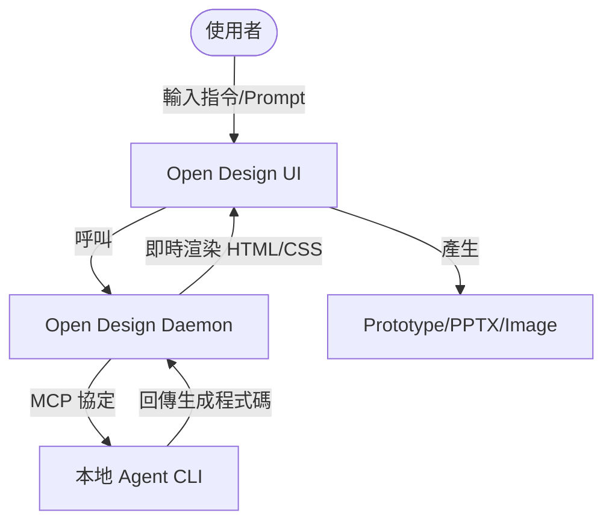

# Open Design 規格文件

## 1. 專案概觀
Open Design 是一個本地優先的開源 Claude Design 替代方案。它提供桌面版應用程式、150+ 設計系統與 100+ 技能，讓 Coding Agent (例如 Claude, Codex, Gemini 等) 可以直接在本地讀寫並渲染出原型的 Web、Mobile App、簡報或圖表。

## 2. 架構與選型
- **前端 (Frontend)**: Web 應用程式 (可能為 Next.js 或 React 基礎)，呈現設計原型的 Iframe 沙盒與操作介面。
- **後端 (Backend)**: Express 或 Node.js Daemon 背景服務，負責串接本地環境與 Agent CLI。
- **Agent CLI**: 支援 21 種常見 Agent (Claude Code, Gemini, Copilot 等)，透過 MCP Server 與 Open Design 連動。
- **執行環境**: Node.js v24.x, pnpm, Corepack。

## 3. 系統脈絡圖 (System Context Diagram)


## 4. 模組關係圖 (Module Relationship)
```mermaid
graph LR
    subgraph Frontend [@open-design/web]
        UI[User Interface]
        Preview[Iframe Sandbox]
    end
    subgraph Backend [@open-design/daemon]
        Server[Express Server]
        MCP[MCP Server]
        PluginMgr[Plugin Manager]
    end
    UI --> Server
    Server --> MCP
    MCP --> PluginMgr
```

## 5. 開發規範 (S.O.L.I.D. & 註解)
- 未來修改需遵循全域規範，包含中英文註解、單元測試要求。
